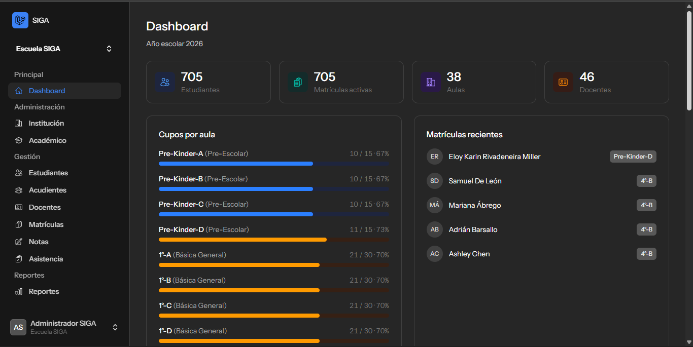
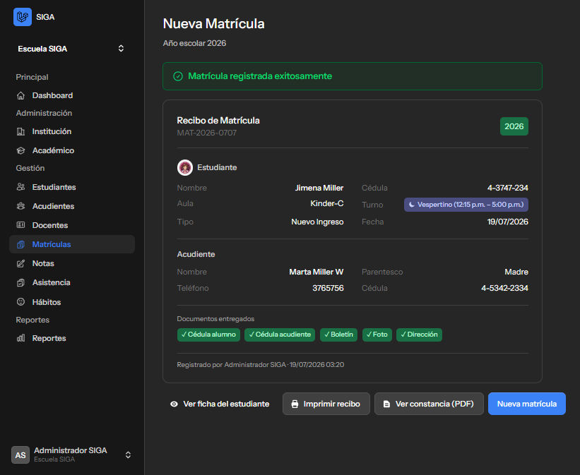
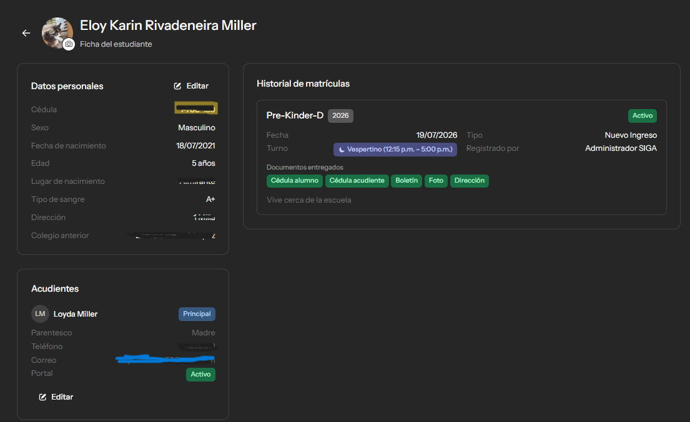
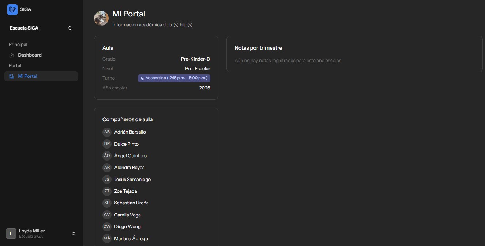
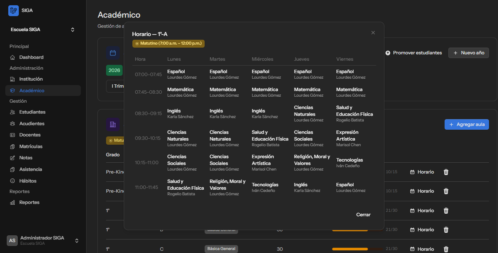
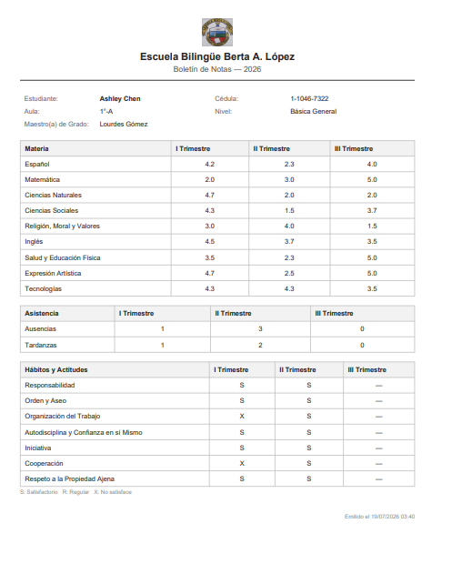
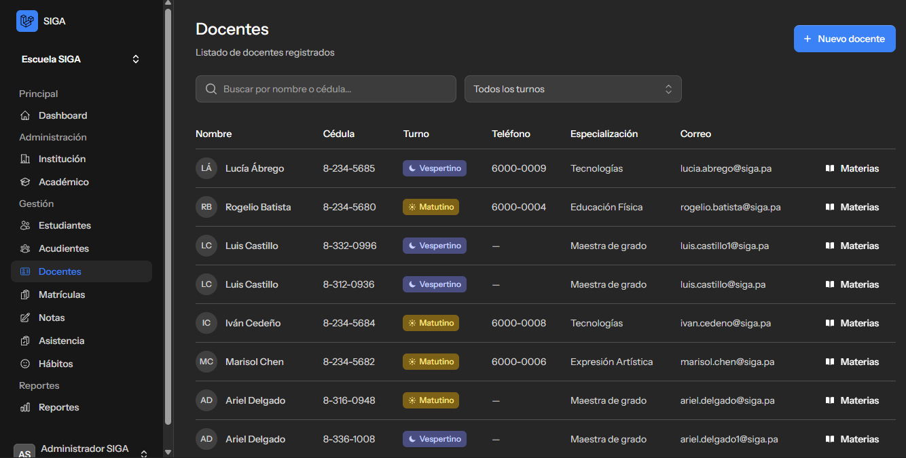
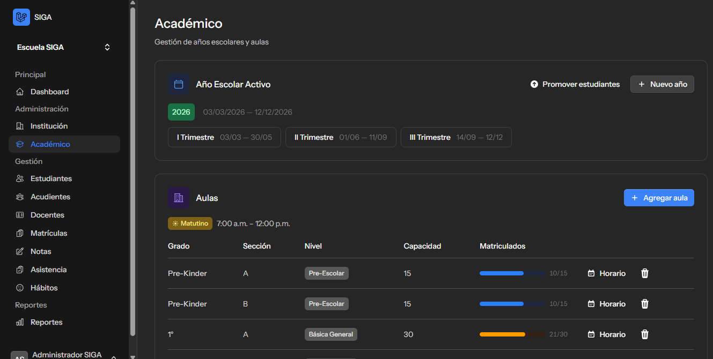

<div align="center">

# 🎓 SIGA — Sistema de Gestión de Información Académica

**Digitaliza el proceso de matrícula, notas y administración de un colegio — de las filas de papel a un sistema web completo.**

[](https://laravel.com)
[](https://livewire.laravel.com)
[](https://php.net)
[](https://postgresql.org)
[](https://docker.com)

[🌐 Ver demo en vivo](https://sigasystemsup.academy) · [Funcionalidades](#-funcionalidades) · [Capturas](#-capturas-de-pantalla) · [Stack técnico](#-stack-técnico) · [Instalación](#-instalación-local)

</div>

---

## 📖 Sobre el proyecto

En muchos colegios, matricular a un estudiante todavía significa hacer fila desde temprano, llenar formularios en papel y entregar copias de cédula, boletines y fotos a mano — para que terminen archivados en una carpeta. **SIGA** reemplaza ese proceso por un sistema web donde secretaría, docentes y acudientes tienen su propio espacio, y toda la información del colegio (estudiantes, matrículas, notas, horarios, asistencia) vive en un solo lugar, segura y accesible desde cualquier dispositivo.

Nació como proyecto universitario, pero está construido pensando en algo más grande: convertirse en un producto real que colegios de primaria y secundaria puedan usar desde el día uno.

## 🌐 Demo en vivo

Puedes explorar el sistema funcionando de verdad (con datos de práctica, no información real de estudiantes) en:

### **[sigasystemsup.academy](https://sigasystemsup.academy)**

> Es un ambiente de demostración con datos sintéticos generados automáticamente (más de 700 estudiantes, docentes, horarios y notas de ejemplo). Si quieres probarlo con una cuenta de administrador, pídele acceso al autor.

## ✨ Funcionalidades

### 🏫 Institución
Datos generales del colegio (nombre, tipo, dirección, contacto) y logo institucional, que aparece automáticamente en todos los reportes en PDF.

### 📅 Académico
- Años escolares con sus 3 trimestres, y activación/rotación entre años.
- Aulas por grado, sección, turno y capacidad — con medidor visual de cupos disponibles.
- **Turnos reales**: Matutino (7:00 a.m. – 12:00 p.m.) y Vespertino (12:15 p.m. – 5:00 p.m.), aplicados de forma consistente en toda la app.
- Copiar la estructura de aulas de un año escolar al siguiente con un clic.
- **Promoción masiva de estudiantes** al siguiente año escolar: el sistema previsualiza quién está listo para promover, quién se gradúa, a quién le falta el promedio mínimo (3.0 en secundaria) y a quién no le cabe un aula disponible — todo antes de confirmar nada.

### 📝 Matrícula
El módulo estrella. Un flujo guiado de 4 pasos que reemplaza la fila y el papel:
1. **Estudiante** — busca por cédula o registra uno nuevo (con foto).
2. **Acudiente** — busca uno existente o registra uno nuevo, con validación para no duplicar cédulas.
3. **Matrícula** — elige el aula. El sistema **solo habilita las aulas que corresponden a la edad del estudiante**, evitando el error clásico de matricular a un niño en el grado equivocado.
4. **Recibo** — recibo de matrícula imprimible al instante, con opción de generar la constancia oficial en PDF.

También soporta retiro, traslado y rehabilitación de matrículas existentes.

### 👨‍🎓 Estudiantes
Ficha completa por estudiante: datos personales, foto, tipo de sangre, condiciones médicas, acudientes vinculados, historial completo de matrículas por año, horario semanal de su aula actual y notas por trimestre — todo editable desde la misma pantalla.

### 👪 Acudientes y Portal
Cada acudiente puede tener acceso propio al sistema para ver, de sus hijos: aula y turno, compañeros de clase, horario semanal y notas por trimestre — sin tener que llamar al colegio para preguntar.

### 👩‍🏫 Docentes
- Cada docente tiene un **turno fijo** (matutino o vespertino) — el sistema no deja mezclar aulas de turnos distintos al asignarle materias.
- Distingue entre **maestro de grado** (da todas las materias generales de su aula) y **especialista** (Inglés, Educación Física, Expresión Artística, Tecnologías — puede dar clase en varias aulas y niveles a la vez).

### 🗓️ Horarios de clase
Horario semanal generado automáticamente por aula, repartiendo las materias de forma realista a lo largo de la semana según el turno — visible desde Académico, la ficha del estudiante y el Portal del acudiente.

### ✅ Asistencia
Registro diario de asistencia por aula: presente, ausente o tardanza, con motivo cuando aplica. Cada docente solo ve y edita la asistencia de las aulas que tiene asignadas.

### 📊 Notas
Captura de calificaciones por aula, materia y trimestre (escala 1.0–5.0), respetando qué docente puede calificar qué materia y aula — un docente no puede tocar notas de una clase que no le corresponde.

### 📄 Reportes en PDF
- **Boletín de notas**, con el nombre del maestro de grado incluido.
- **Constancia de matrícula.**
- **Listado de estudiantes por aula.**

Todos con vista previa dentro de la misma app (sin forzar descargas) y con el logo del colegio incluido automáticamente.

### 📈 Dashboard
Vista general con indicadores clave (estudiantes, matrículas activas, aulas, docentes) y medidores de ocupación por aula, adaptados al rol de quien inicia sesión.

### 🔐 Roles, permisos y seguridad
- Roles diferenciados: **Administrador, Secretaria, Docente, Acudiente** — cada uno ve solo lo que le corresponde, reforzado tanto en la interfaz como en el servidor.
- **Una sola sesión activa por usuario**: si alguien inicia sesión en un dispositivo nuevo, la sesión anterior se cierra y muestra un aviso casi al instante (como WhatsApp Web), sin necesidad de recargar la página.
- HTTPS de extremo a extremo, contraseñas con reglas reforzadas en producción, y protección contra comandos destructivos de base de datos.

### 📱 Multiplataforma
Funciona igual de bien desde una laptop que desde el celular de un padre de familia — pensado para que nadie necesite una computadora para revisar las notas de su hijo.

## 📸 Capturas de pantalla

<!--
  Instrucciones: reemplaza cada imagen en docs/screenshots/ con una captura real
  (mismo nombre de archivo) y esta sección se actualiza sola, sin tocar el markdown.
-->

<table>
  <tr>
    <td width="50%">
      <p align="center"><strong>Dashboard</strong></p>
      
    </td>
    <td width="50%">
      <p align="center"><strong>Nueva matrícula</strong></p>
      
    </td>
  </tr>
  <tr>
    <td width="50%">
      <p align="center"><strong>Ficha del estudiante</strong></p>
      
    </td>
    <td width="50%">
      <p align="center"><strong>Portal del acudiente</strong></p>
      
    </td>
  </tr>
  <tr>
    <td width="50%">
      <p align="center"><strong>Horario semanal</strong></p>
      
    </td>
    <td width="50%">
      <p align="center"><strong>Boletín de notas (PDF)</strong></p>
      
    </td>
  </tr>
  <tr>
    <td width="50%">
      <p align="center"><strong>Gestión de docentes</strong></p>
      
    </td>
    <td width="50%">
      <p align="center"><strong>Académico — aulas y turnos</strong></p>
      
    </td>
  </tr>
</table>

## 🔧 Stack técnico

| Categoría | Tecnología |
|---|---|
| Backend | Laravel 13 (PHP 8.4) |
| Frontend reactivo | Livewire 4 + Flux UI 2 |
| Base de datos | PostgreSQL 17 |
| Autenticación | Laravel Fortify |
| Multi-tenant | Laravel Teams |
| Permisos | Spatie laravel-permission |
| Reportes | Dompdf |
| Contenedores | Docker (PHP 8.4-CLI + Caddy como reverse proxy con HTTPS automático) |
| Infraestructura | AWS Lightsail |

## 🚀 Despliegue

La app corre en un contenedor Docker propio (sin depender de servicios de PaaS con memoria limitada), con **Caddy** como proxy que obtiene y renueva certificados HTTPS automáticamente vía Let's Encrypt. Ver el `Dockerfile` y `docker-entrypoint.sh` en la raíz del proyecto.

## 💻 Instalación local

Requisitos: PHP 8.3+, Composer, Node.js, PostgreSQL.

```bash
git clone https://github.com/EloyKarinR/Sistema-De-Gestion-De-Info-Academic.git
cd Sistema-De-Gestion-De-Info-Academic

composer install
npm install

cp .env.example .env
php artisan key:generate

# Configura tu conexión a PostgreSQL en .env, luego:
php artisan migrate --seed

composer run dev
```

Esto levanta el servidor de Laravel, Vite y la cola de trabajos al mismo tiempo. Entra a `http://localhost:8000`.

## 🗺️ Roadmap

- [ ] Multi-tenant real para vender a varios colegios a la vez (la base ya está instalada).
- [ ] Pagos y estados de cuenta por estudiante (el modelo de datos ya existe, falta la interfaz).
- [ ] Flujo de rehabilitación académica para estudiantes bajo el promedio mínimo.
- [ ] Notificaciones a acudientes (correo/SMS) ante eventos importantes.

## 👤 Autor

Proyecto universitario desarrollado por **Eloy Rivadeneira**, con visión de convertirse en un producto real para colegios de Panamá.
